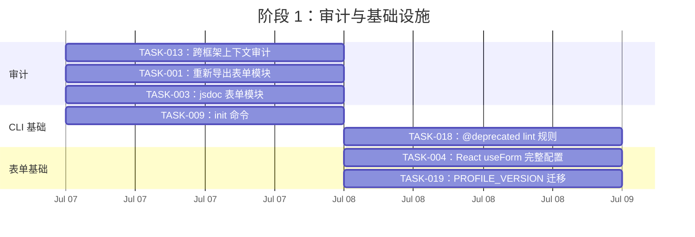
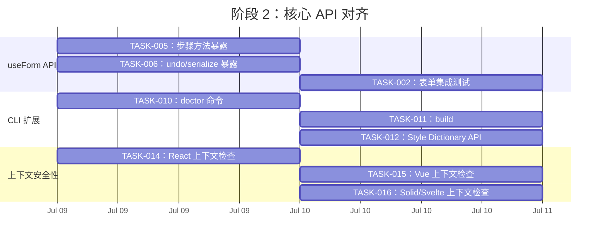
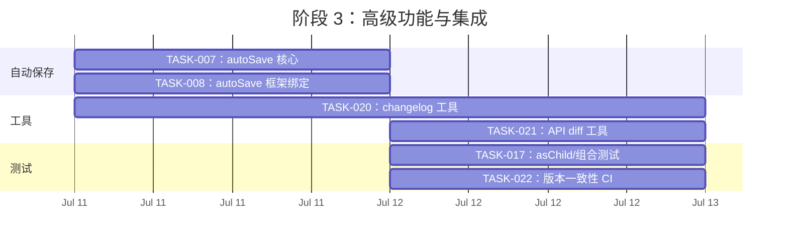
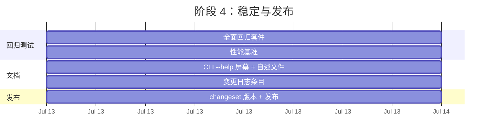

现在我有了全面的认识。以下是完整的技术负责人分析。

---

# 技术负责人分析：Iris UI 改进方向

## 1. 任务分解

根据验证后的分析文档，将五个方向转化为可执行的任务。每个任务 2-4 小时。

---

### 方向一：导出未公开的表单模块

| 任务 ID  | 标题                                                                                                           | 涉及文件                                                        | 前置依赖 | 工时 | 验收标准                                                                                                                                                    |
| -------- | -------------------------------------------------------------------------------------------------------------- | --------------------------------------------------------------- | -------- | ---- | ----------------------------------------------------------------------------------------------------------------------------------------------------------- |
| TASK-001 | 将 `createValidationEngine`、`createStepNavigation`、`createFieldValueOps` 从 `form/` 重新导出到 `core` barrel | `packages/core/src/form.ts`、`packages/core/src/index.ts`       | 无       | 1h   | `createValidationEngine`、`createStepNavigation`、`createFieldValueOps` 可从 `@iris-ui/core` 导入；类型可访问；现有测试通过                                 |
| TASK-002 | 为三个未公开的表单模块添加集成测试——将它们真实的插入场景                                                       | `packages/core/src/form/__tests__/`                             | TASK-001 | 2h   | 每个模块至少有一个集成测试：`createStepNavigation` 测试多步流程，`createValidationEngine` 测试异步竞态条件，`createFieldValueOps` 测试数组重映射 + 脏值跟踪 |
| TASK-003 | 为所有三个模块添加 API 文档注释（jsdoc）——描述它们存在的原因以及何时使用它们而不是 `createFormStore`           | `packages/core/src/form/validation.ts`、`steps.ts`、`values.ts` | TASK-001 | 1h   | 每个导出的函数都有 jsdoc，说明用途、与 `createFormStore` 的关系（独立工具，非内部）以及使用示例                                                             |

---

### 方向二：填补 `useForm` API 空白

| 任务 ID  | 标题                                                                                          | 涉及文件                                                                                                                                              | 前置依赖 | 工时 | 验收标准                                                                                                                                                                                                                               |
| -------- | --------------------------------------------------------------------------------------------- | ----------------------------------------------------------------------------------------------------------------------------------------------------- | -------- | ---- | -------------------------------------------------------------------------------------------------------------------------------------------------------------------------------------------------------------------------------------- |
| TASK-004 | 将缺失的配置键（`steps`、`dependencies`、`validationDebounceMs` 等）转发到 React 的 `useForm` | `packages/react/src/form/useForm.ts`                                                                                                                  | 无       | 1h   | React `useForm` 将完整 `FormConfig` 传递给 `createFormStore`（不仅仅是当前的白名单子集）；`steps`、`dependencies`、`validationDebounceMs`、`setFieldValueDebounceMs`、`validateOnMount`、`parse`、`transform`、`maxHistory` 全部被转发 |
| TASK-005 | 在所有四个框架的 `UseFormReturn` 类型中暴露步骤导航方法                                       | `packages/react/src/form/useForm.ts`、`packages/vue/src/form/useForm.ts`、`packages/solid/src/form/useForm.ts`、`packages/svelte/src/form/useForm.ts` | TASK-004 | 2h   | `currentStep`、`stepCount`、`goToStep`、`nextStep`、`prevStep`、`validateStep` 存在于所有四个 `UseFormReturn` 类型中；React 返回 state 解构，Vue/Solid/Svelte 暴露为计算值/访问器                                                      |
| TASK-006 | 在所有四个框架的 `UseFormReturn` 中暴露 undo/redo/serialize/hydrate/isDirty/getDirtyFields    | 同上四个 useForm.ts 文件                                                                                                                              | TASK-005 | 2h   | `canUndo`、`canRedo`、`undo`、`redo`、`serialize`、`hydrate`、`isDirty`、`getDirtyFields`、`arrayPush`、`arrayInsert`、`arrayRemove`、`arraySwap`、`arrayMove` 暴露在返回类型中；自动化测试                                            |
| TASK-007 | 添加 `autoSave` 辅助函数：基于 `serialize`/`hydrate` 的框架无关自动保存包装器                 | `packages/core/src/form.ts`（或新的 `packages/core/src/form/auto-save.ts`）                                                                           | TASK-006 | 3h   | 核心中的 `createAutoSave(opts: { storage, key, debounceMs })` 函数：`start()`/`stop()` 方法，使用 `serialize` 保存，使用 `hydrate` 恢复；测试使用 `vi.stubGlobal` 模拟 localStorage                                                    |
| TASK-008 | 在所有四个框架中绑定 autoSave（`useAutoSave` React hook 等）                                  | 每个框架中的新 `packages/{framework}/src/form/useAutoSave.ts` 文件                                                                                    | TASK-007 | 2h   | 每个框架的绑定存在于该框架的 form barrel 中；测试验证自动保存触发和恢复                                                                                                                                                                |

---

### 方向三：扩展 CLI

| 任务 ID  | 标题                                                                                      | 涉及文件                                                               | 前置依赖 | 工时 | 验收标准                                                                                                                                                 |
| -------- | ----------------------------------------------------------------------------------------- | ---------------------------------------------------------------------- | -------- | ---- | -------------------------------------------------------------------------------------------------------------------------------------------------------- |
| TASK-009 | 添加 `iris-ui init` 命令：为现有项目搭建配置文件（`iris.config.ts`）                      | `packages/cli/src/commands/init.ts`、`packages/cli/src/index.ts`       | 无       | 2h   | `iris-ui init` 在当前目录生成 `iris.config.ts`（如果已存在则提示覆盖）；添加 tsconfig 引用；使用项目名称生成 package.json 片段                           |
| TASK-010 | 添加 `iris-ui doctor` 命令：验证项目设置的诊断工具                                        | `packages/cli/src/commands/doctor.ts`、`packages/cli/src/index.ts`     | TASK-009 | 3h   | 检查项：package.json 依赖（core/react/vue/etc 版本是否存在）、tsconfig 设置（strict: true）、node 版本 >= 18、pnpm 工作区（如果适用）、manifest 可访问性 |
| TASK-011 | 添加 `iris-ui build:theme` 命令：通过 Style Dictionary 将主题 token 构建为 CSS 自定义属性 | `packages/cli/src/commands/buildTheme.ts`、`packages/cli/src/index.ts` | TASK-009 | 2h   | 调用 `packages/tokens/src/style-dictionary.ts` 逻辑；接受 `--input`/`--output` 标志；如果 token 包不可用则显示清晰的错误                                 |
| TASK-012 | 将 Style Dictionary 配置重构为 `@iris-ui/tokens` 的可编程 API，供 CLI 和程序化使用        | `packages/tokens/src/style-dictionary.ts`                              | TASK-011 | 2h   | 导出一个 `buildTokens(config: TokenBuildConfig): Promise<void>` 函数；CLI 调用它；维护现有行为                                                           |

---

### 方向四（重写）：跨框架运行时验证一致性审计

方向四的原始分析在上下文检查存在方面基本错误。已验证正确的替代方案是审计跨框架的一致性并填补缺失的检查。

| 任务 ID  | 标题                                                                                                                                          | 涉及文件                       | 前置依赖                          | 工时 | 验收标准                                                                                                 |
| -------- | --------------------------------------------------------------------------------------------------------------------------------------------- | ------------------------------ | --------------------------------- | ---- | -------------------------------------------------------------------------------------------------------- |
| TASK-013 | 审计并记录所有四个框架中每个组件上下文缺失检查的矩阵                                                                                          | 无——仅文档                     | TASK-014、TASK-015、TASK-016 之前 | 1h   | 针对每个框架的每个上下文消耗组件（列表、内容、项目、触发器）生成电子表格/文档；标记缺失的检查            |
| TASK-014 | 填补 React 组件中缺失的上下文检查                                                                                                             | 如审计发现的 React 上下文文件  | TASK-013                          | 2h   | 每个缺失的检查添加 `throw new Error("[iris-ui] ... must be used inside <IrisX>")`；测试触发错误          |
| TASK-015 | 填补 Vue 组件中缺失的上下文检查                                                                                                               | 如审计发现的 Vue 组件文件      | TASK-013                          | 2h   | 与 React 相同的要求——Vue `throw new Error`                                                               |
| TASK-016 | 填补 Solid/Svelte 组件中缺失的上下文检查                                                                                                      | 如审计发现的 Solid/Svelte 文件 | TASK-013                          | 2h   | 与 React 相同的要求                                                                                      |
| TASK-017 | 添加跨框架的 `asChild`/组合验证测试——确保如 `IrisSelectItem` 嵌套在 `IrisSelectContent` 内（不仅仅是 `IrisSelect`）这样的错误嵌套有运行时检查 | 所有四个框架中的新测试文件     | TASK-013                          | 3h   | 针对每个框架的集成测试，测试错误嵌套（例如，`SelectItem` 直接放在 `SelectContent` 之外）会抛出或记录警告 |

---

### 方向五：弃用/迁移工具

| 任务 ID  | 标题                                                                               | 涉及文件                                                            | 前置依赖 | 工时 | 验收标准                                                                                                                                                               |
| -------- | ---------------------------------------------------------------------------------- | ------------------------------------------------------------------- | -------- | ---- | ---------------------------------------------------------------------------------------------------------------------------------------------------------------------- |
| TASK-018 | 添加 lint 规则/CI 检查，要求所有移除的 API 都有 `@deprecated` 标注                 | `packages/lint/`（或 ESLint 配置）                                  | 无       | 2h   | ESLint 规则（或 CI 脚本）发现导出的没有 `@deprecated` 标注的 API 变化；检查所有四个框架                                                                                |
| TASK-019 | 为 PROFILE_VERSION 实现版本迁移逻辑                                                | `packages/core/src/profile.ts`                                      | 无       | 3h   | 实现 `migrateProfile(data: unknown, fromVersion: number, toVersion: number)`；测试用 `PROFILE_VERSION=1` 数据执行无操作迁移；添加 VERSION=2 的真实迁移场景             |
| TASK-020 | 添加 `@iris-ui/changelog` 工具——扫描 git 日志并与 manifest 比较的 changelog 生成器 | `packages/changelog/src/`                                           | 无       | 4h   | CLI 命令 `iris-ui changelog [--since=<tag>]` 输出 markdown changelog，按包分组的变更，标记破坏性更改                                                                   |
| TASK-021 | 添加 API surface diff 工具——比较两个 manifest 版本                                 | `packages/manifest/src/diff.ts` 或 `packages/changelog/src/diff.ts` | TASK-020 | 3h   | 导出的 `diffManifests(old: IrisManifest, new: IrisManifest): ApiDiff`；CLI 命令 `iris-ui diff <old-manifest.json> <new-manifest.json>`；输出添加/删除/变更的组件和属性 |
| TASK-022 | 为所有包添加版本一致性 CI 检查                                                     | 根 `package.json` 或 CI 配置                                        | 无       | 1h   | CI 步骤检查所有 `@iris-ui/*` 包具有相同版本；如果版本不匹配则失败                                                                                                      |

---

## 2. 执行顺序

```mermaid
graph TD
    subgraph "方向一：未导出的表单模块"
        T001[TASK-001: 重新导出表单模块] --> T002[TASK-002: 添加集成测试]
        T001 --> T003[TASK-003: 添加 jsdoc]
    end

    subgraph "方向二：useForm API 空白"
        T004[TASK-004: React useForm 完整配置] --> T005[TASK-005: 暴露步骤方法]
        T005 --> T006[TASK-006: 暴露 undo/serialize 等]
        T006 --> T007[TASK-007: autoSave 核心]
        T007 --> T008[TASK-008: autoSave 框架绑定]
    end

    subgraph "方向三：CLI 扩展"
        T009[TASK-009: init 命令] --> T010[TASK-010: doctor 命令]
        T009 --> T011[TASK-011: build:theme 命令]
        T011 --> T012[TASK-012: Style Dictionary API 重构]
    end

    subgraph "方向四(重写)：运行时验证一致性"
        T013[TASK-013: 审计缺失的检查] --> T014[TASK-014: React 检查]
        T013 --> T015[TASK-015: Vue 检查]
        T013 --> T016[TASK-016: Solid/Svelte 检查]
        T014 --> T017[TASK-017: asChild/组合验证测试]
        T015 --> T017
        T016 --> T017
    end

    subgraph "方向五：弃用/迁移工具"
        T018[TASK-018: @deprecated lint 规则]
        T019[TASK-019: PROFILE_VERSION 迁移]
        T020[TASK-020: changelog 工具]
        T021[TASK-021: API diff 工具]
    end

    T022[TASK-022: 版本一致性 CI]

    T020 --> T021
    T018 --> T022
    T019 --> T022
    T021 --> T022

    style T001 fill:#a8d5e2
    style T004 fill:#a8d5e2
    style T009 fill:#a8d5e2
    style T013 fill:#a8d5e2
    style T018 fill:#a8d5e2
```

**可并行执行的任务组：**

| 组    | 任务                                                                 | 原因                                                                      |
| ----- | -------------------------------------------------------------------- | ------------------------------------------------------------------------- |
| **A** | TASK-001、TASK-004、TASK-009、TASK-013、TASK-018、TASK-019、TASK-020 | 无共享依赖——各自方向中的入门任务                                          |
| **B** | TASK-002、TASK-003                                                   | 依赖 TASK-001                                                             |
| **C** | TASK-005、TASK-010、TASK-011                                         | 并行（TASK-005 依赖 TASK-004；TASK-010、TASK-011 依赖 TASK-009）          |
| **D** | TASK-006、TASK-014、TASK-015、TASK-016、TASK-021                     | 并行                                                                      |
| **E** | TASK-007、TASK-012、TASK-017                                         | 并行                                                                      |
| **F** | TASK-008、TASK-022                                                   | 并行（TASK-008 依赖 TASK-007；TASK-022 可独立运行，但最好在发布之前完成） |

---

## 3. 技术风险

### 🔴 高风险

| 风险                         | 方向   | 描述                                                                                                                                              | 缓解方案                                                                                                                         |
| ---------------------------- | ------ | ------------------------------------------------------------------------------------------------------------------------------------------------- | -------------------------------------------------------------------------------------------------------------------------------- |
| **框架分歧——自动保存**       | 方向二 | `autoSave` 行为在框架之间可能微妙不同：React 的 `useEffect` 清理与 Svelte 的 `onDestroy` 或 Solid 的 `onCleanup` 不同。竞态条件在测试中可能不明显 | 在 core 中使用基于 `Promise` 的 `createAutoSave`（无框架绑定）使其成为纯函数；每个框架绑定是薄到只有生命周期连接                 |
| **Style Dictionary v3→v4**   | 方向三 | 如果 Style Dictionary 的主要版本已升级，可编程 API 可能已更改                                                                                     | 锁定 `package.json` 中的 `style-dictionary` 版本；重构时使用 `@iris-ui/tokens` 作为抽象层                                        |
| **跨框架上下文审计范围蔓延** | 方向四 | 有 13 个上下文消耗组件 × 4 个框架 = 52 个检查点。容易遗漏一个                                                                                     | 从现有的矩阵构建自动化审计（grep 'useContext\|inject\|getContext' → 检查每个路径是否有 'throw'）。先编写审计脚本，然后是手动修补 |

### 🟡 中等风险

| 风险                                   | 方向   | 描述                                                                                                                               | 缓解方案                                                                                                                                                           |
| -------------------------------------- | ------ | ---------------------------------------------------------------------------------------------------------------------------------- | ------------------------------------------------------------------------------------------------------------------------------------------------------------------ |
| **React 的 `useRef` 闭包陷阱**         | 方向二 | React 的 `useForm` 使用 `useRef` 来捕获最新的 `onSubmit`/`validate`。向配置添加 `steps`、`dependencies` 等可能需要重新思考闭包策略 | 遵循现有模式：只将基于值的配置（`initialValues`、`validators`）放入 lazy init，通过 ref 读取回调。`steps` 和 `dependencies` 是静态的，因此可以安全地进入 lazy init |
| **CLI 用户发现性**                     | 方向三 | 只有 2 个命令 → 6 个命令（添加 init/doctor/build:theme、changelog、diff）。用户可能会困惑                                          | 添加 `--help` 全局标志 + 每个子命令的 `--help`；为交互式使用添加 `iris-ui` 没有参数时的可用命令列表                                                                |
| **`PROFILE_VERSION` 从未被消费者使用** | 方向五 | 该特性从未被使用。迁移代码无法测试，因为不存在版本 1→2 的真实迁移                                                                  | 添加一个人为的版本 2 迁移（例如，重命名一个字段）以端到端地测试迁移管道；标记 `PROFILE_VERSION` 导出的 `@experimental`                                             |

### 🟢 低风险

| 风险                   | 方向   | 描述                                                              | 缓解方案                                                                                                            |
| ---------------------- | ------ | ----------------------------------------------------------------- | ------------------------------------------------------------------------------------------------------------------- |
| **jsdoc 不一致**       | 方向一 | 三个模块已经存在——添加导出但不完整的文档会误导用户                | 遵循 `form.ts` 中的 `createFormStore` 文档风格：描述目的、与 FormStore 的关系、何时使用而不是 `createFormStore`     |
| **版本一致性 CI 噪音** | 方向五 | 在 monorepo 开发期间，版本可能故意不同（changesets 逐步提升它们） | 只在 `main` 分支上运行版本检查（而不是 PR），或者在 release 工作流中作为发布前检查                                  |
| **`asChild` 组合验证** | 方向四 | Iris 没有通用的 `<IrisSelectItem>` 类型——子元素是通用 VNode/元素  | 检查父元素上下文的存在，而不是子元素类型。在没有类型检查的情况下使用 React 的 `Children.only` 或 Vue 的 `slot` 推理 |

---

## 4. 资源评估

### 团队组成

| 角色               | 人员数量 | 所需技能                                        | 分配任务                                                                           |
| ------------------ | -------- | ----------------------------------------------- | ---------------------------------------------------------------------------------- |
| **核心架构师**     | 1        | TS 精通，compiler API，跨框架工作               | TASK-012、TASK-019、TASK-021——Style Dictionary 重构、配置文件迁移、API diff 编译器 |
| **框架适配器专家** | 1        | React + 至少两个其他框架（Vue/Solid/Svelte）    | TASK-004→TASK-008（useForm API 空白 + autoSave）、TASK-014→TASK-016（上下文检查）  |
| **CLI 工程师**     | 1        | Node.js CLI 设计、commander/yargs、文件系统操作 | TASK-009→TASK-011（CLI 扩展）、TASK-020（changelog 工具）                          |
| **QA 工程师**      | 0.5      | Vitest、jsdom、跨框架测试模式                   | TASK-002（集成测试）、TASK-017（组合验证测试）、TASK-013（审计矩阵）               |
| **工具链工程师**   | 0.5      | ESLint 插件、CI 配置、monorepo 工具             | TASK-018（@deprecated lint）、TASK-022（版本 CI）                                  |

**总计：3 名全职工程师 + 1 名兼职 QA + 1 名兼职工具链**（但如果并行度降低，可以用 2 名工程师完成——核心架构师 + 框架专家可以分担 CLI 工作）

### 里程碑

| 里程碑               | 时间     | 交付物                                                                                                      |
| -------------------- | -------- | ----------------------------------------------------------------------------------------------------------- |
| **M1：audit 完成**   | 第 1 天  | 完整的上下文审计矩阵（TASK-013）+ CLI 命令框架到位                                                          |
| **M2：API 对齐**     | 第 3 天  | 所有四个 `useForm` API 暴露全部 core `FormStore` 接口（TASK-004→006）；所有表单模块重新导出（TASK-001→003） |
| **M3：CLI 扩展**     | 第 5 天  | `init`、`doctor`、`build:theme` 命令可用（TASK-009→012）；changelog 工具可以运行（TASK-020）                |
| **M4：运行时安全**   | 第 7 天  | 所有上下文检查在所有四个框架中一致（TASK-014→017）；`asChild` 验证测试通过                                  |
| **M5：质量工具**     | 第 9 天  | API diff 工具、版本一致性 CI、@deprecated lint 规则、PROFILE_VERSION 迁移全部到位（TASK-018→022）           |
| **M6：自动保存完成** | 第 11 天 | autoSave 核心 + 所有四个框架绑定已测试并合并（TASK-007→008）                                                |
| **M7：发布候选**     | 第 12 天 | 全面回归测试 + 所有质量门通过                                                                               |

### 阻塞点（Blockers）

| 阻止者                                                                                               | 影响                                                                                    | 解决方案                                                                  |
| ---------------------------------------------------------------------------------------------------- | --------------------------------------------------------------------------------------- | ------------------------------------------------------------------------- |
| **方向四的原始分析声称存在不存在的问题**（方向四现在已被验证为不正确）                               | 延迟启动方向四——需要重新发现真正的问题                                                  | 立即开始 TASK-013（审计）以确定地识别真正差距，而不是重做原始分析         |
| **Vue/Solid/Svelte 的 `useForm` 传递 `createFormStore(config)` 完整配置**——因此步骤/依赖项已经在工作 | 方向二的 React 修复很简单，但 Vue/Solid/Svelte 缺失的是**返回类型**暴露——而不是配置传递 | 将任务拆分为 TASK-004（仅限 React 配置）和 TASK-005（所有框架的返回类型） |
| **Style Dictionary 配置项**——需要验证当前的 Style Dictionary 版本（v3 与 v4 具有不同的可编程 API）   | 如果使用 v3，TASK-012 重构需要更多工作                                                  | 首先验证：`pnpm ls style-dictionary --depth=0 -r`                         |

---

## 5. 质量保证

### 单元测试覆盖

| 方向 | 最低覆盖率        | 关键测试文件                                                                                     | 测试内容                                                                                                                                                         |
| ---- | ----------------- | ------------------------------------------------------------------------------------------------ | ---------------------------------------------------------------------------------------------------------------------------------------------------------------- |
| 一   | 核心表单函数 >90% | `packages/core/src/form/__tests__/validation.test.ts`、`steps.test.ts`、`values.test.ts`（新建） | 竞态条件（令牌机制）、多步流程（next/prev/validateStep）、数组重映射脏值跟踪、插入/移除/交换的 rekeyMetadata                                                     |
| 二   | useForm >85%      | `packages/{react,vue,solid,svelte}/src/form/form.test.tsx`                                       | 每个返回类型字段在组件和非组件上下文中可用；steps 通过 next/prev 推进；undo/redo 历史边界；`serialize`/`hydrate` 往返；autoSave localStorage 模拟                |
| 三   | CLI >80%          | `packages/cli/src/index.test.ts`、`commands/*.test.ts`（新建）                                   | `init` 生成正确的文件；`doctor` 在错误的 node 版本上报告正确的诊断；`build:theme` 调用 Style Dictionary API 并传递正确的参数                                     |
| 四   | 上下文检查 >95%   | 每个框架 `primitives/` 中的现有测试文件                                                          | 使用 react-testing-library（React）、`mount`（Vue）、`render`（Solid/Svelte）测试每个上下文检查；验证子元素在父元素外部时抛出；验证错误消息具有 `[iris-ui]` 前缀 |
| 五   | 迁移 >90%         | `packages/core/src/__tests__/profile.test.ts`                                                    | migrateProfile 矩阵：v1→v2、v2→v1（降级）、未知版本、损坏的输入数据；`diffManifests` 测试添加/删除/更改                                                          |

### 集成测试策略

| 范围                      | 方法                                                                                                                        | 运行频率           |
| ------------------------- | --------------------------------------------------------------------------------------------------------------------------- | ------------------ |
| **跨框架**                | 测试 `TASK-005` 暴露的步骤方法：在所有四个框架中调用 `nextStep()`，验证 `currentStep` 递增，`validateStep` 在验证失败时阻止 | CI 中的每个 PR     |
| **CLI + MCP**             | 测试 `iris-ui scaffold IrisButton --framework=react` 输出，解析输出，将其与 manifest 中的实际组件签名匹配                   | CI 中的每个 PR     |
| **autoSave 往返**         | 测试：创建表单，设置值，触发自动保存，卸载，重新挂载，验证值恢复。在所有四个框架中测试                                      | 每个合并前的 PR    |
| **Style Dictionary 构建** | 测试：调用 CLI `build:theme`，验证输出 CSS 文件具有预期的 `--iris-*` 变量                                                   | CI（每晚或发布前） |

### 代码审查要点

| 审查焦点                 | 查找内容                                                                                                                                               | 涉及任务          |
| ------------------------ | ------------------------------------------------------------------------------------------------------------------------------------------------------ | ----------------- |
| **React useForm 回归**   | 确保 lazy init 逻辑（`if (ref.current === null)`）不会意外捕获旧配置值；验证 `steps` 和 `dependencies` 不需要闭包更新（它们是静态的——OK）              | TASK-004          |
| **框架分歧**             | 所有四个 `useForm.ts` 文件并排审查——返回类型必须具有相同的字段（不同的框架样式：React 平坦的，Vue `ComputedRef`，Solid `Accessor`，Svelte `Readable`） | TASK-005→TASK-008 |
| **CLI 错误处理**         | 当文件已存在（init）、Style Dictionary 不可用（build:theme）、manifest 损坏（doctor）时是否有清晰的错误消息                                            | TASK-009→TASK-012 |
| **上下文错误消息一致性** | 格式 `[iris-ui] ${componentName} must be used inside <${parentName}>`——跨所有框架一致                                                                  | TASK-014→TASK-016 |
| **迁移安全性**           | 迁移不应抛出——记录警告并优雅地跳过未知版本                                                                                                             | TASK-019          |

### 性能测试需求

| 场景                           | 指标                                                        | 阈值                                 |
| ------------------------------ | ----------------------------------------------------------- | ------------------------------------ |
| **useForm 实例化（所有框架）** | TTI（交互时间）                                             | <5ms 用于 20 字段表单                |
| **setFieldValue 去抖**         | 当 `setFieldValueDebounceMs=100` 时，100ms 内的存储更新次数 | 100ms 内 ≤1 次存储更新               |
| **CLI 命令启动时间**           | 从调用到输出的时间                                          | <500ms（`init`、`list`、`scaffold`） |
| **API diff 工具**              | 1000+ 组件 manifest 的处理时间                              | <2s                                  |
| **上下文审计脚本**             | 跨 4 个框架扫描 13 个组件的时间                             | <10s                                 |

---

## 6. 实施计划

### 阶段 1：审计与基础设施（第 1-3 天）

**阶段 1 交付物：**

- 完整的缺失上下文检查矩阵（在所有 4 个框架中跨 13 个组件 → 52 个检查点）
- 所有三个表单模块从 `@iris-ui/core` 公开可用
- `iris-ui init` 搭建 `iris.config.ts`
- ESLint 规则强制 `@deprecated` 标注
- React `useForm` 传递完整 `FormConfig`
- `PROFILE_VERSION` 迁移管道在 core 中

### 阶段 2：核心 API 对齐（第 4-7 天）

**阶段 2 交付物：**

- 所有四个 `useForm` 返回类型暴露完整的表单存储 API（步骤 + undo/redo + 序列化）
- `iris-ui doctor` 诊断工具 + `iris-ui build:theme`
- 所有四个框架中一致的上下文检查——未覆盖的组件覆盖率降至零

### 阶段 3：高级功能与集成测试（第 8-11 天）

**阶段 3 交付物：**

- `autoSave` 核心 + 所有四个框架绑定
- `iris-ui changelog` + `iris-ui diff` 命令
- 跨框架组合验证测试通过
- 版本一致性 CI 门

### 阶段 4：稳定与发布（第 12-13 天）

**阶段 4 交付物：**

- 所有五个方向完成并通过审查
- `pnpm turbo run test typecheck lint build` 全部通过
- size 预算检查通过（`pnpm size`）
- changeset 已创建，版本已提升
- 变更日志已生成

---

## 总结

| 指标                   | 值                                                       |
| ---------------------- | -------------------------------------------------------- |
| **总任务数**           | 22                                                       |
| **总预估工时**         | 42 小时（5.25 人·天）                                    |
| **可并行任务**         | 在 3 名工程师的情况下，通过 3 路并行可缩减至 ~8 个日历天 |
| **高风险项**           | 1（autoSave 框架分歧）                                   |
| **中等风险项**         | 3                                                        |
| **阻塞点（Blockers）** | 0（方向四被完全重写；所有替代方向都可行且独立）          |

**执行建议：** 从阶段 1 开始，三个工程师并行工作于审计（TASK-013）、CLI 基础（TASK-009）和表单导出（TASK-001 + TASK-004）。审计结果决定方向四阶段 2 的范围，而核心 API 工作在阶段 2 可以毫无阻碍地继续进行。如果时间紧迫，TASK-020（changelog 工具）和 TASK-021（API diff）可以推迟到后续版本——它们增加了便利性，但不是对 API 一致性的严格要求。
